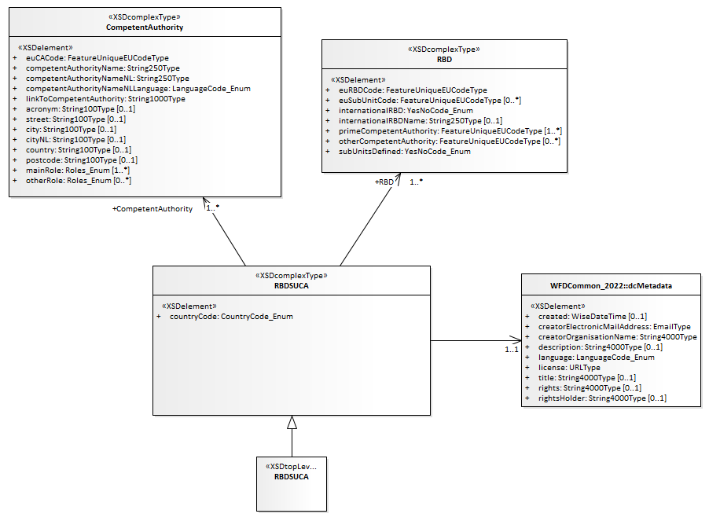
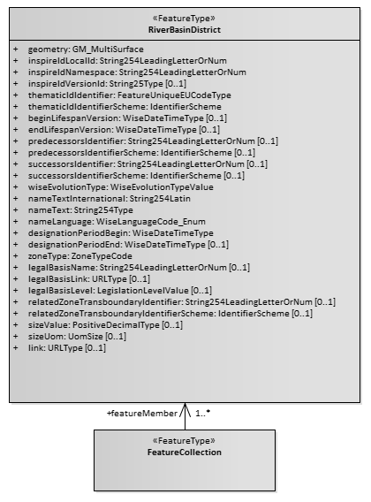
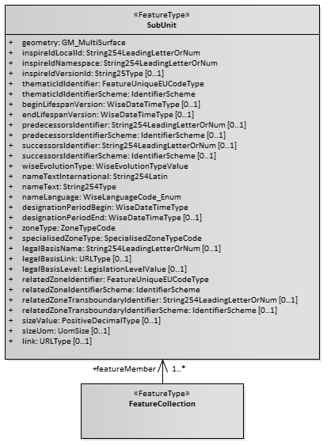
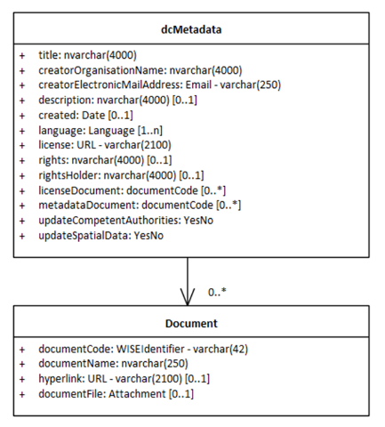
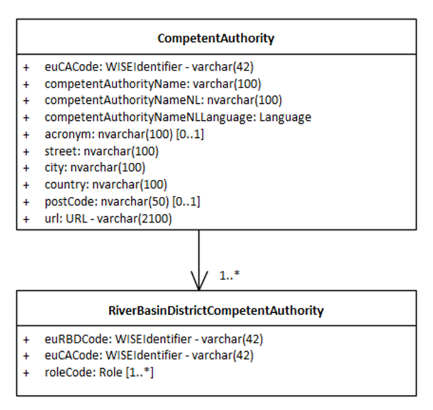
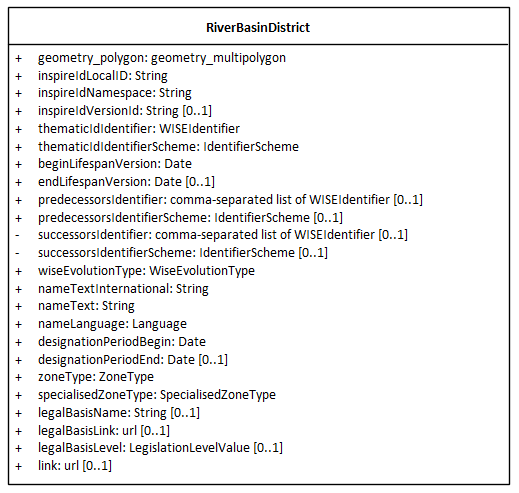

WFD - River Basin Districts & Competent Authorities
***************************************************

| **PROPOSAL**
| **Version 2026.02.13**
  
:download:`PDF document<pdf/WFD_4rd_cycle_RiverBasinDistrictsAndCompetentAuthorities_v20260213.pdf>`

.. contents:: Table of Contents
   :depth: 2
   :local:

..
   List of Figures
   ===============

   `Figure 1. Class diagram for River Basin Districts, Subunits and
   Competent Authorities (RBDSUCA_2022) schema. <#_Ref221642320>`__
   `1 <#_Ref221642320>`__

   `Figure 2. Partial class diagram for RiverBasinDistrict and Subunit
   classes. <#_Ref221876448>`__ `1 <#_Ref221876448>`__

   `Figure 3. River Basin Districts and Competent Authorities – 4th cycle
   of reporting <#_Ref221089723>`__ `2 <#_Ref221089723>`__

   List of Tables
   ==============

..

.. _purpose-and-overview-ref:

Purpose and overview
====================

The document revises the River Basin Districts, Subunits and Competent
Authorities classes used in the |3rd| cycle of reporting of the
Water Framework Directive River Basin Management Plans (Figure 1), as
well as the associated spatial data in the RiverBasinDistrict dataset
and SubUnit dataset (Figure 2).

Figure 1. Class diagram for River Basin Districts, Subunits and Competent
Authorities schema - |3rd| cycle.

|image1|

Figure 2. Partial class diagram for RiverBasinDistrict and Subunit
classes.

+-----------------------------------+-----------------------------------+
| |image2left|                      | |image2right|                     |
+-----------------------------------+-----------------------------------+

| A proposal is presented for the electronic reporting in the
  |4th| cycle (Figure 3).
| The reporting of the units of management (i.e. the River Basin
  Districts) and of the competent authorities is combined into a single
  dataflow. The overall structure of the new **River Basin Districts and
  Competent Authorities** dataflow has been aligned with similar
  dataflows, e.g. under the Floods Directive [#floods-directive-footnote]_.

Reporting is only requested under the following conditions:

-  If there are changes to the spatial delineation and/or the
   identifiers of one or more River Basin Districts (since the
   |3rd| cycle), the spatial dataset must be
   reported.

-  If there are changes to the competent authorities or their roles, the
   descriptive data must be reported in accordance with Article 3(8) and
   3(9) of the WFD.

Data providers can specify which datasets are being updated (spatial
data, descriptive data, or both). Information about subunits is no
longer requested. The reporting of metadata has also been simplified.

Figure 3. River Basin Districts and Competent Authorities - |4th| cycle

+-----------------------+-----------------------+----------------------+
| |image3a|             | |image3b|             | |image3c|            |
+-----------------------+-----------------------+----------------------+
| a) Documents          | b) Descriptive data   | c) Spatial data      |
+-----------------------+-----------------------+----------------------+

.. _documents-dataset-ref:

Documents dataset - |4th| cycle
===================================================

The Documents dataset (Figure 3.a) follows the standard structure used
in various WISE dataflows:

-  | The **dcMetadata** table is required and contains only one record
     per delivery (i.e. per country). It provides the basic Dublin Core
     metadata elements about the delivery.
   | It also functions as a "manifest file" explaining if the delivery
     contains an update of the spatial data (updateSpatialData = 'Yes')
     and/or of the competent authorities (updateCompetentAuthorities=
     'Yes'). If required by the data providers, and especially if
     spatial data is being reported, the licenseDocument and the
     metadataDocument attributes allow the provision of additional
     information.

-  The structure of the **Document** table is standard is the WISE
   dataflows: it allows the upload of documents (for example, PDFs) or
   the provision of a link to a document stored in a publicly accessible
   national web site.

.. _descriptive-dataset-ref:

Descriptive dataset - |4th| cycle
=====================================================

The Descriptive dataset (Figure 3.b) contains two tables:

-  The **CompetentAuthority** table contains basic information about
   each Competent Authority.

-  The **RiverBasinDistrictCompetentAuthority** table associates each
   Competent Authority with a River Basin District and specified the
   role(s) of the competent authority in that specific RBD.

.. _spatial-dataset-ref:

Spatial dataset - |4th| cycle
=================================================

The Spatial dataset (Figure 3) contains only the RiverBasinDistrict
spatial table.
As stated before, Subunits are no longer requested in the |4th|
cycle of reporting.

The following changes have been made to the RiverBasinDistrict table (in
comparison to version 7.06 used in the |3rd| cycle of reporting):

-  Two attributes were removed, because they can be derived: sizeValue
   and sizeUom.

-  Two attributes were removed, since they are not required at EU level:
   relatedTransboundaryIdentifier and
   relatedTransboundaryIdentifierScheme.

-  The date values are now requested as simply as YYYY-MM-DD, because
   that is the format used by the data providers (beginLifespanVersion,
   endLifespanVersion, designationPeriodBegin, designationPeriodEnd).

-  One attribute was moved from the descriptive data into the spatial
   data specialisedZoneType :
   {'internationalRiverBasinDistrict','nationalRiverBasinDistrict'}

-  The attributes thematicIdIdentifierScheme and zoneType have been kept
   for clarity's sake, although all records in the national delivery
   will have the same fixed value.

-  Likewise, the attributes successorsIdentifier and
   successorsIdentifierScheme have been kept for clarity's sake although
   their value will always be NULL - the appropriate value will be
   derived and included in the published WISE datasets that refer to the
   previous reporting cycles).

.. rubric:: Footnotes

.. [#floods-directive-footnote]

   See Floods Directive - Units of Management and Competent Authorities
   [2025] at https://reportnet.europa.eu/public/dataflow/1473

.. include:: ../_sharedFiles/Links.rst

.. images-placeholder

.. substitutions-placeholder

.. |3rd| replace:: 3\ :sup:`rd`  
.. |4th| replace:: 4\ :sup:`th`  